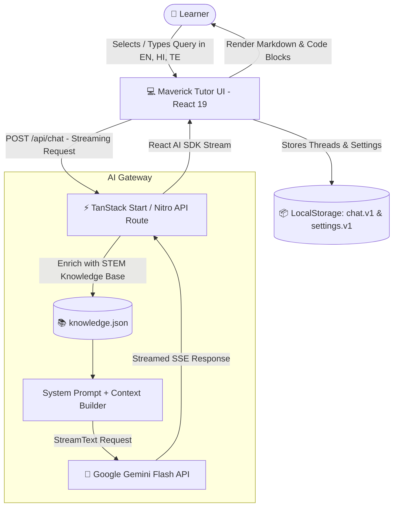

# 🎓 Maverick Tutor (AI Tutor)

<div align="center">


### **Next-Generation Multilingual AI Tutoring Platform**

_Democratizing AI, Machine Learning, and Science Education in English, Hindi (हिन्दी), and Telugu (తెలుగు)._

[](https://react.dev/)
[](https://www.typescriptlang.org/)
[](https://tanstack.com/)
[](https://tailwindcss.com/)
[](https://ai.google.dev/)
[](https://vitejs.dev/)
[](LICENSE)
[](https://pages.github.com/)

[Explore Features](#-key-features) • [Quick Start](#-quick-start) • [Architecture](#-architecture) • [Deployment](#-deployment-guide) • [Settings & Customization](#-customization--theming)

</div>

---

## 🌟 Overview

**Maverick Tutor** is an interactive, multilingual AI educational assistant designed to bridge language gaps in STEM learning. Built with **React 19**, **TanStack Router**, **Tailwind CSS v4**, and powered directly by **Google's Gemini models**, it provides instant, step-by-step explanations for complex concepts across artificial intelligence, machine learning, physics, and computer science.

Whether you're inquiring in English, Hindi, or Telugu, Maverick Tutor detects your language and script dynamically, responding with rich markdown formatting, intuitive analogies, and interactive chat history.

---

## ✨ Key Features

- 🌐 **Native Multilingual Support**:
  - Seamlessly answers in **English**, **Hindi (हिन्दी)**, and **Telugu (తెలుగు)**.
  - Automatic language and script detection, with effortless prompt-based language switching.
- ⚡ **Ultra-Fast Streaming with Gemini AI**:
  - Direct integration with Google's Gemini models (`gemini-3-flash-preview` / OpenAI-compatible endpoint) using the **Vercel AI SDK**.
  - Real-time token streaming with live thinking indicators and response abort controls.
- 🧠 **Curated STEM Knowledge Base**:
  - Pre-trained grounding knowledge pairs covering deep neural networks, model training pipelines, physics fundamentals (gravity, mechanics), CPU architectures, and internet networking protocols.
- 🗂️ **Threaded Conversation Management**:
  - Full local thread management: create new threads, auto-generate descriptive conversation titles, delete past chats, and switch between discussions seamlessly.
- 🎨 **Deep Customization & Theming**:
  - **Dynamic Theming**: Light, Dark, and System modes with live color property recalculation.
  - **Brand Customization**: Custom avatar uploads (with local base64 persistence), customizable primary accent colors, and chat canvas backgrounds.
  - **Widget Controls**: Configurable display name, custom welcome greeting message, contact channels (email, phone, social), and widget alignment (`bottom-right` / `bottom-left`).
- 📝 **Rich Markdown & Code Rendering**:
  - Full support for lists, tables, bold step-by-step breakdowns, and formatted code blocks.
- 🚀 **GitHub Pages CI/CD Included**:
  - Ready-to-go GitHub Actions workflow (`.github/workflows/deploy-pages.yml`) for continuous deployment of the static frontend.

---

## 🏗️ Architecture

Maverick Tutor combines the performance of Vite and TanStack Router on the frontend with streaming AI gateways:



---

## 💻 Tech Stack

| Domain                       | Technology                                                                                    | Description                                                  |
| :--------------------------- | :-------------------------------------------------------------------------------------------- | :----------------------------------------------------------- |
| **Frontend Framework**       | [React 19](https://react.dev/)                                                                | Modern concurrent React architecture                         |
| **Routing & Meta-framework** | [TanStack Router](https://tanstack.com/router) & [TanStack Start](https://tanstack.com/start) | Fully type-safe client & server routing                      |
| **Styling & Design System**  | [Tailwind CSS v4](https://tailwindcss.com/) + Radix UI primitives                             | High-performance CSS engine with glassmorphic accents        |
| **AI Orchestration**         | [Vercel AI SDK](https://sdk.vercel.ai/) (`ai`, `@ai-sdk/react`, `@ai-sdk/openai-compatible`)  | Robust hooks for streaming LLM responses                     |
| **LLM Provider**             | [Google Gemini](https://ai.google.dev/) (`gemini-3-flash-preview`)                            | Low-latency, high-accuracy multilingual reasoning            |
| **State & Persistence**      | Custom LocalStorage Store                                                                     | Instant client-side persistence for conversations & settings |
| **Icons & UI Extras**        | [Lucide React](https://lucide.dev/), [Sonner](https://sonner.emilkowal.ski/)                  | Clean, accessible iconography and fluid toast notifications  |
| **Build & Bundler**          | [Vite 7](https://vitejs.dev/)                                                                 | Rapid HMR and optimized production bundles                   |

---

## 🚀 Quick Start

### Prerequisites

- **Node.js**: v20.x or higher installed ([Download Node.js](https://nodejs.org/))
- **npm** or **bun** package manager
- **Google Gemini API Key**: Free key from [Google AI Studio](https://aistudio.google.com/)

### 1. Clone the Repository

```bash
git clone https://github.com/bhavishya-006/AI_Tutor.git
cd AI_Tutor
```

### 2. Install Dependencies

```bash
npm install
```

### 3. Configure Environment Variables

Copy the example environment file:

```bash
cp .env.example .env
```

Open `.env` and configure your Gemini API Key:

```env
GEMINI_API_KEY=your_gemini_api_key_here
```

> **Note**: Get your Gemini API key from [Google AI Studio](https://aistudio.google.com/). The backend uses Google's OpenAI-compatible endpoint directly without requiring third-party proxies.

### 4. Run Locally

Start the development server:

```bash
npm run dev
```

Open [http://localhost:5173](http://localhost:5173) (or the port specified in terminal) in your browser.

---

## 📁 Project Structure

```text
AI_Tutor/
├── .github/
│   └── workflows/
│       └── deploy-pages.yml      # Automated GitHub Pages CI/CD workflow
├── public/                       # Static public assets
├── src/
│   ├── assets/                   # Static images, icons, and bot avatar
│   │   └── bot-logo.png
│   ├── components/               # UI components (Radix primitives, buttons, inputs)
│   ├── hooks/                    # Reusable React hooks (e.g. use-settings)
│   ├── lib/
│   │   ├── ai-gateway.server.ts  # Gemini OpenAI-compatible provider configuration
│   │   ├── chat-storage.ts       # LocalStorage thread persistence & utilities
│   │   ├── knowledge.json        # Curated multilingual STEM Q&A knowledge base
│   │   ├── settings.ts           # Settings store, color themes, and CSS variables
│   │   └── utils.ts              # Class name merging and styling helpers
│   ├── routes/
│   │   ├── __root.tsx            # Application root layout & toaster provider
│   │   ├── index.tsx             # Entry route redirecting to active or new thread
│   │   ├── $threadId.tsx         # Main chat interface & streaming response window
│   │   ├── history.tsx           # Conversation history manager
│   │   ├── settings.tsx          # Appearance, avatar, and customization page
│   │   └── api/
│   │       └── chat.ts           # Server endpoint streaming Gemini AI completions
│   ├── router.tsx                # TanStack Router instance
│   ├── server.ts                 # Nitro server entrypoint
│   └── styles.css                # Global stylesheet & Tailwind CSS configuration
├── .env.example                  # Template for environment variables
├── package.json                  # Dependencies and scripts
├── tsconfig.json                 # TypeScript compiler configuration
├── vite.config.ts                # Vite & TanStack Router build plugins
└── README.md                     # Project documentation
```

---

## ⚙️ Customization & Theming

Maverick Tutor provides a built-in `/settings` interface allowing users or administrators to tailor the experience:

- **Display Identity**: Customize the bot name (default: _Maverick Tutor_) and upload custom avatar images (PNG/JPEG under 1MB converted to base64 Data URLs).
- **Color Palettes**: Live picker for primary accent color (default: `#7c5cff`) and chat canvas background (`#fcfbff`).
- **Theme Modes**: Seamless toggling between **Light**, **Dark**, and **System** themes.
- **Custom Greetings**: Tailor welcome messages for students or specific domain audiences.
- **Contact Channels**: Optional email, phone, or social links displayed on empty chat states.
- **Placement**: Widget positioning options (`bottom-right` or `bottom-left`).

All settings are stored in local storage under `chatbot.settings.v1` and dispatched dynamically to CSS variables (`--primary`, `--ring`).

---

## 🧪 Sample Prompts to Try

| Language            | Sample Prompt                                                   | Expected Topic                     |
| :------------------ | :-------------------------------------------------------------- | :--------------------------------- |
| **English**         | `"Explain how neural networks learn step by step."`             | Machine Learning / Backpropagation |
| **English**         | `"Why is gravity important and what happens if it disappears?"` | Physics / Celestial Mechanics      |
| **हिन्दी (Hindi)**  | `"एआई कैसे काम करता है? सरल शब्दों में समझाइए।"`                | Artificial Intelligence Basics     |
| **हिन्दी (Hindi)**  | `"मशीन लर्निंग के विभिन्न चरण क्या हैं?"`                       | Machine Learning Lifecycle         |
| **తెలుగు (Telugu)** | `"గురుత్వాకర్షణ శక్తి అంటే ఏమిటి? ఉదాహరణలతో వివరించండి."`       | Gravitational Physics              |
| **తెలుగు (Telugu)** | `"కంప్యూటర్ డేటాను ఎలా ప్రాసెస్ చేస్తుంది?"`                    | Computer Architecture / CPU        |

---

## 🌐 Deployment Guide

### Deploying Frontend to GitHub Pages

This repository is pre-configured with a GitHub Actions workflow:

1. Push this project to the `main` branch of your repository.
2. In GitHub, navigate to **Settings** → **Pages**.
3. Under **Build and deployment**, set **Source** to **GitHub Actions**.
4. Push a commit or trigger the workflow under the **Actions** tab.
5. The workflow builds the static site and deploys it to `https://<username>.github.io/<repo-name>/`.

> **Important Note on GitHub Pages**: GitHub Pages serves static frontend assets and does not run server-side Node.js routes (`/api/chat`). To enable AI chat functionality on production:
>
> - Deploy the backend API on serverless platforms such as **Vercel**, **Cloudflare Pages / Workers**, **Netlify**, or **Render**.
> - Set `GEMINI_API_KEY` as an environment variable on your hosting provider.

---

## 📜 Available Scripts

| Command           | Action                                               |
| :---------------- | :--------------------------------------------------- |
| `npm run dev`     | Starts Vite local development server with hot reload |
| `npm run build`   | Builds optimized production bundle                   |
| `npm run preview` | Previews the production build locally                |
| `npm run lint`    | Runs ESLint checks across TypeScript and React code  |
| `npm run format`  | Formats all files using Prettier                     |

---

## 🤝 Contributing

Contributions are welcome! If you have suggestions, bug fixes, or new features:

1. **Fork** the repository
2. **Create your feature branch**: `git checkout -b feature/AmazingFeature`
3. **Commit your changes**: `git commit -m 'Add some AmazingFeature'`
4. **Push to the branch**: `git push origin feature/AmazingFeature`
5. **Open a Pull Request**

---

## 📄 License

Distributed under the **MIT License**. See `LICENSE` for more information.

---

<div align="center">

Made with ❤️ for STEM learners everywhere.

**[⭐ Star this repository if you find it helpful!](https://github.com/bhavishya-006/AI_Tutor)**

</div>
